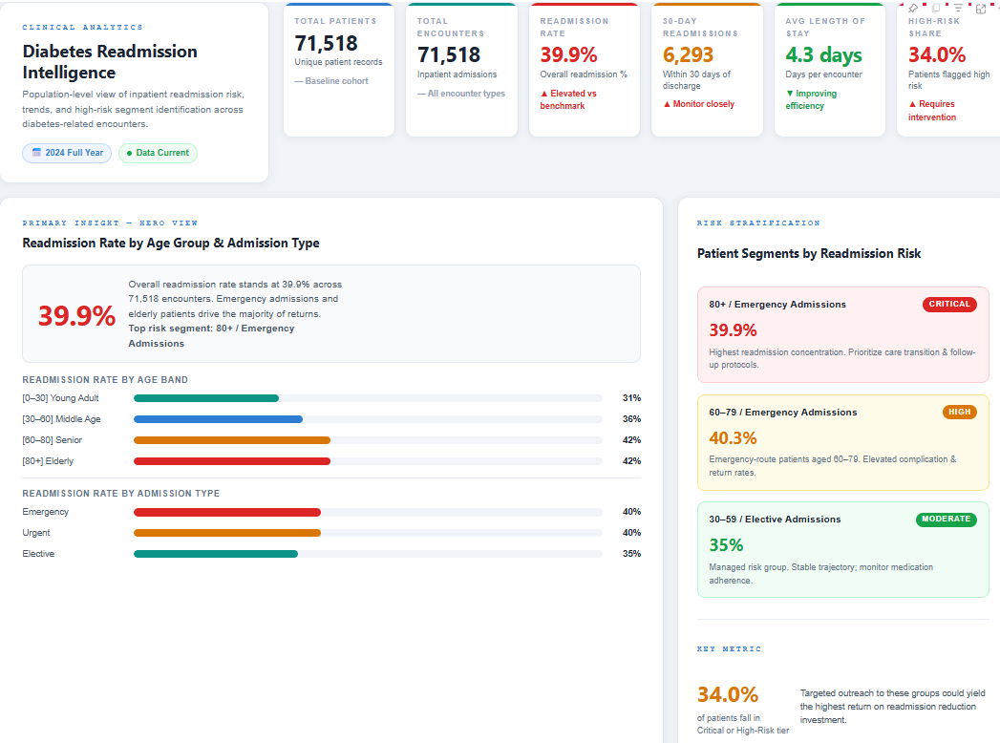
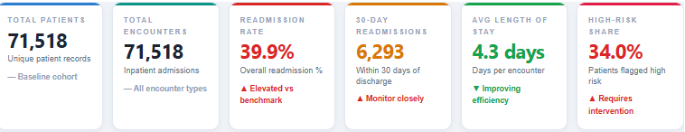
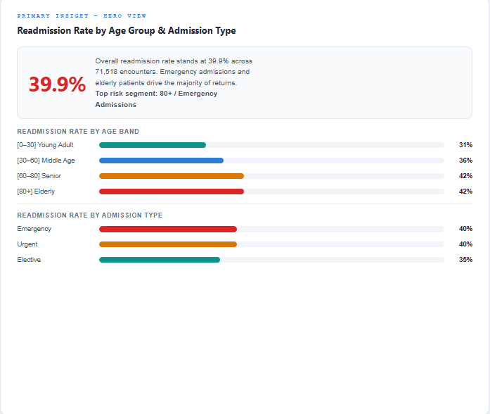
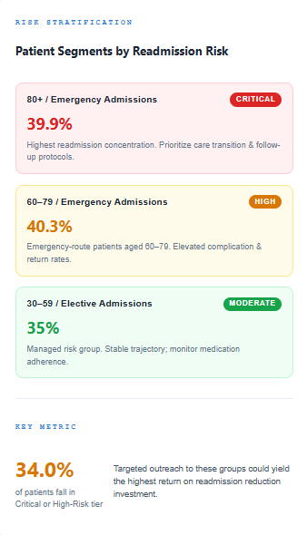
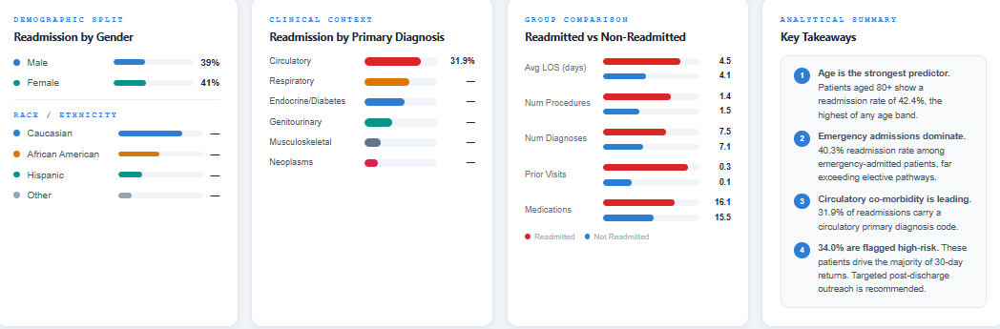

# 🏥 Healthcare Readmission Analysis Dashboard

A Power BI analytics dashboard built to monitor, understand, and explore
diabetes-related hospital readmission trends. Designed for clinical staff,
hospital administrators, and data analysts to identify high-risk patient
segments and act on readmission drivers.



---

## 📌 Project Summary

Diabetes readmission is a major cost and quality-of-care challenge for
hospitals. This dashboard transforms raw encounter data from 130 US hospitals
into an executive-ready analytics interface, surfacing patterns across
demographics, admission types, diagnoses, and treatment factors.

**Dataset**: UCI Diabetes 130-US Hospitals (1999–2008)
**Records**: ~100,000 inpatient encounters
**Tool**: Power BI Desktop (HTML Content visual + DAX)

---

## 📊 Dashboard Sections

### KPI Summary Row


Six headline metrics at a glance:
- Total Patients, Total Encounters
- Overall Readmission Rate
- 30-Day Readmission Count
- Average Length of Stay
- High-Risk Patient Share

### Hero Chart — Readmission by Age & Admission Type


The primary analytical focal point. Dynamic bar charts show readmission
rates broken down by age band ([0–30], [30–60], [60–80], [80+]) and
admission type (Emergency, Urgent, Elective). All bars driven live by DAX measures.

### Risk Stratification Panel


Patients segmented into Critical, High, and Moderate risk tiers based on
age and admission type combinations, with readmission rates and clinical
context per tier.

### Supporting Analytics


Four supporting panels:
1. **Readmission by Gender & Race/Ethnicity**
2. **Readmission by Primary Diagnosis Category**
3. **Readmitted vs Non-Readmitted comparison** (LOS, procedures,
   diagnoses, prior visits, medications)
4. **Key Takeaways** — auto-generated insight summary

---

## 🗄️ Data

| File | Description |
|---|---|
| `diabetic_data.csv` | Original raw dataset from UCI |
| `diabetic_data_cleaned.csv` | Cleaned and feature-engineered dataset |
| `IDS_mapping.csv` | Admission/discharge ID label mapping |
| `Cleaning.ipynb` | Full Python cleaning pipeline |

**Key engineered columns:**
- `readmitted_binary` — 1/0 flag from the original `<30 / >30 / NO` labels
- `early_readmission` — 1 if readmitted within 30 days
- `age_midpoint` — numeric midpoint extracted from age range strings
- `diag_1_category` — ICD-9 code grouped into clinical categories
- `admission_type` / `discharge_disposition` — mapped from IDS reference file

---

## ⚙️ Technical Implementation

### DAX Architecture

All KPIs, bar widths, trend text, and risk values are computed as individual
DAX measures and injected into a single master `Dashboard HTML` measure that
renders the entire visual dynamically inside Power BI's HTML Content visual.

Key measure example:

```dax
Readmission Rate =
VAR readmitted = CALCULATE(COUNTROWS(diabetic_data_cleaned),
                            diabetic_data_cleaned[readmitted_binary] = 1)
VAR total = COUNTROWS(diabetic_data_cleaned)
RETURN FORMAT(DIVIDE(readmitted, total, 0), "0.0%")
```

### HTML Content Visual

The dashboard UI is built entirely in HTML + inline CSS, generated as a DAX
string measure. No JavaScript, no external libraries — fully compatible with
Power BI's sandboxed HTML Content visual.

---

## 🚀 How to Run

1. Clone this repo
```bash
git clone https://github.com/Pishuishu89/Healthcare-Readmission-Analysis.git
```
2. Open `Diabetes Dashboard.pbix` in Power BI Desktop
3. If prompted to reconnect data: point source to `diabetic_data_cleaned.csv`
4. All measures and visuals load automatically

**Requirements**: Power BI Desktop (free) — [download here](https://powerbi.microsoft.com/desktop)

---

## 🛠️ Tech Stack

| Layer | Tool |
|---|---|
| Reporting | Power BI Desktop |
| Data Cleaning | Python, pandas, Jupyter |
| Visualization | DAX + HTML/CSS (HTML Content visual) |
| Version Control | Git / GitHub |

---

## 👤 Author

**Ishaan** — Software Engineering (Big Data), York University
[GitHub](https://github.com/Pishuishu89)
